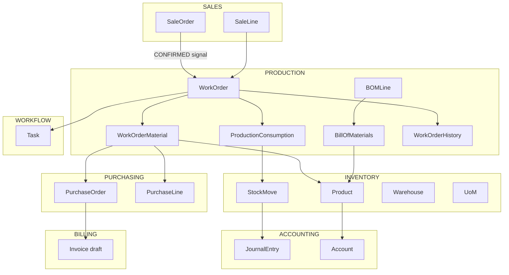

# 🏭 Auditoría Técnica: Módulo de Producción — ERPGrafico
**Fecha:** 2026-05-11 | **Alcance:** Backend + Frontend + Integraciones cruzadas  
**Revisor:** Análisis estático de código fuente

---

## 1. Visión General del Módulo

El módulo `production` implementa el proceso de **transformación de materias primas en productos terminados** para una imprenta gráfica. Su objeto central es el `WorkOrder` (Orden de Trabajo — OT), que actúa como contenedor de estado que recorre un pipeline de etapas.

### 1.1 Entidades Centrales

| Entidad | Archivo | Responsabilidad |
|---------|---------|----------------|
| `WorkOrder` | `models.py` | Orden de fabricación, dueña del estado maestro |
| `WorkOrderMaterial` | `models.py` | Materias primas asignadas a la OT (planificado vs. consumido) |
| `ProductionConsumption` | `models.py` | Registro de consumo real + vínculo 1:1 con `StockMove` |
| `BillOfMaterials` (BOM) | `models.py` | Receta maestra de componentes por producto fabricable |
| `BillOfMaterialsLine` | `models.py` | Línea individual de componente en el BOM |
| `WorkOrderHistory` | `models.py` | Log inmutable de transiciones de etapa |

---

## 2. Estados y Flujo de Etapas

### 2.1 Dimensión `Status` (macro-estado)

```
DRAFT → PLANNED → IN_PROGRESS → FINISHED
                    ↘ CANCELLED
```

> **Observación:** `PLANNED` existe en el modelo pero **no hay lógica de transición explícita** hacia él en `services.py`. Es un estado huérfano en la práctica.

### 2.2 Dimensión `Stage` (micro-etapa de proceso)

```
MATERIAL_ASSIGNMENT
    ↓
MATERIAL_APPROVAL
    ↓
OUTSOURCING_ASSIGNMENT     ← solo si hay tercerizados
    ↓
PREPRESS                   ← condicional (requires_prepress)
    ↓
PRESS                      ← condicional (requires_press)
    ↓
POSTPRESS                  ← condicional (requires_postpress)
    ↓
OUTSOURCING_VERIFICATION   ← solo si hay tercerizados confirmados
    ↓
RECTIFICATION              ← ajuste de cantidades reales
    ↓
FINISHED ──► (ejecuta finalize_production)
```

> **Observación crítica:** El sistema tiene **dos dimensiones de estado independientes** (`Status` + `Stage`). El campo `Status` es actualizado dentro de `transition_to()` de forma reactiva, **no hay una máquina de estados que obligue la coherencia entre ambas**. Esto produce riesgos:  
> - Una OT puede tener `status=DRAFT` y `stage=PRESS` si algo falla a mitad de transición.  
> - El campo `PLANNED` en `Status` nunca es asignado por el servicio.

---

## 3. Ciclo de Vida Completo de una OT

### 3.1 Origen de creación (3 rutas)

#### Ruta A — Desde Nota de Venta (señal automática)
```
SaleOrder.status → CONFIRMED
    ↓ [signals.py: post_save]
    ↓ solo si product.requires_advanced_manufacturing == True
WorkOrderService.create_from_sale_line(sale_line)
```
- Lee el BOM activo del producto
- Escala las cantidades del BOM por el factor `sale_quantity / bom_yield`
- Crea `WorkOrderMaterial` por cada línea del BOM (fuente: `'BOM'`)
- Crea tarea `OT_CREATION` en `workflow`
- Mapea `sale_line.manufacturing_data` → `stage_data` (prepress/press/postpress specs)

#### Ruta B — Desde Despacho (Flujo Express)
```
SaleDelivery confirmada
    ↓ [services.py: create_ot_for_delivery_line]
    ↓ solo si product.mfg_auto_finalize == True
WorkOrder creada + transition_to(FINISHED) inmediato
```
- Crea OT y la finaliza en la misma transacción
- Descuenta materiales del stock inmediatamente
- Registra entrada del producto terminado en inventario

#### Ruta C — Manual (UI)
```
POST /api/production/orders/create_manual/
    ↓ [views.py: create_manual → WorkOrderService.create_manual]
    ↓ requiere product_id + quantity + uom_id + warehouse_id
WorkOrder con is_manual=True
```

### 3.2 Transición de Etapas (`WorkOrderService.transition_to`)

```
POST /api/production/orders/{id}/transition/
  body: { next_stage, notes, data, files }
```

**Lógica interna:**
1. Fusiona `data` en `stage_data[next_stage.lower()]`
2. Valida y adjunta archivos (`validate_file_size`, `validate_file_extension`)
3. Auto-completa tareas `OT_{OLD_STAGE}_APPROVAL` pendientes
4. Crea nueva tarea de aprobación para la etapa destino
5. Si avanza: valida que no haya aprobaciones pendientes del stage anterior
6. Si retrocede: resetea tareas de etapas "deshechas"
7. Si `next_stage == OUTSOURCING_ASSIGNMENT → *`: genera OCs automáticas
8. Si `next_stage == FINISHED`: bloquea si hay OCs sin recibir → llama `finalize_production`

### 3.3 Finalización (`finalize_production`)

Este es el **corazón del proceso de transformación de materias primas**:

```
Para cada WorkOrderMaterial (no-servicio):
  1. Convierte qty_planned (UoM línea → UoM base del componente)
  2. Valida stock disponible (lanza ValidationError si insuficiente)
  3. Crea StockMove (OUT, -qty)
  4. Actualiza WorkOrderMaterial.quantity_consumed
  5. Crea ProductionConsumption (registro de trazabilidad)

Para el producto terminado:
  6. Determina qty producida (sale_line.quantity o actual_quantity_produced)
  7. Convierte a UoM base del producto
  8. Actualiza Costo Promedio Ponderado (WAC) del producto
  9. Crea StockMove (IN, +qty)

Para productos sin track_inventory:
  10. Genera Asiento Contable automático:
      DR: COGS/Gasto (cuenta del producto o configuración global)
      CR: Inventario de Componentes (agrupado por cuenta)
```

> **Observación crítica:** El paso de contabilidad (10) **solo se ejecuta si `track_inventory=False`**. Para productos con `track_inventory=True` **no se genera asiento contable automático** al finalizar producción. La entrada a inventario (StockMove IN) existe pero no tiene contrapartida contable automática → **brecha contable para productos con inventario rastreado**.

---

## 4. Integraciones con Otros Módulos

### 4.1 → Inventario (`inventory`)

| Punto de contacto | Dirección | Qué ocurre |
|---|---|---|
| `BillOfMaterials` → `Product(MANUFACTURABLE)` | READ | Receta consulta el catálogo de productos |
| `WorkOrderMaterial.component` → `Product` | READ | Asignación de componentes |
| `StockMove` creado en `finalize_production` | WRITE | Descuento de materias primas (OUT) |
| `StockMove` entrada producto terminado | WRITE | Ingreso a inventario del producto fabricado (IN) |
| `Product.cost_price` (WAC) actualizado | WRITE | Costo ponderado del producto terminado actualizado |
| `UoMService.convert_quantity` | READ | Conversiones de unidades en cálculos de materiales |
| `get_stock_available()` en serializer | READ | Disponibilidad de stock por bodega (consulta directa `StockMove`) |

> **Observación N+1:** El serializer `WorkOrderMaterialSerializer.get_stock_available()` hace consultas individuales por material para obtener el stock de la bodega. Con 20 materiales = 20 queries adicionales.

### 4.2 → Ventas (`sales`)

| Punto de contacto | Dirección | Qué ocurre |
|---|---|---|
| `SaleOrder.status == CONFIRMED` | TRIGGER | Dispara creación automática de OTs (vía señal) |
| `WorkOrder.sale_order` FK | READ | OT conoce su NV asociada |
| `WorkOrder.sale_line` FK | READ | OT conoce la línea específica (producto + cantidad + datos de fabricación) |
| `SaleLine.manufacturing_data` | READ | Specs de diseño/folio/contacto mapeadas a `stage_data` |
| `sale_line.quantity` | READ | Define cantidad producida en OTs vinculadas a NV |

> **Observación:** La rectificación (`rectify_production`) **solo puede ajustar la cantidad producida en OTs manuales**. Para OTs vinculadas a NV, la cantidad producida es siempre la de la línea de venta, sin posibilidad de ajuste. Esto puede generar problemas si hay mermas o sobreproducción.

### 4.3 → Compras (`purchasing`)

| Punto de contacto | Dirección | Qué ocurre |
|---|---|---|
| `WorkOrderMaterial.is_outsourced` | TRIGGER | Materiales tercerizados generan OC automática al salir de `OUTSOURCING_ASSIGNMENT` |
| `PurchaseOrder` creada automáticamente | WRITE | `_create_outsourcing_purchase_orders()` crea OC en estado `CONFIRMED` |
| `PurchaseLine` creada | WRITE | Una línea por material tercerizado |
| `WorkOrderMaterial.purchase_line` | WRITE | FK que vincula el material con la línea de OC |
| `BillingService.create_purchase_bill()` | WRITE | Factura de compra draft creada automáticamente |
| Validación en `transition_to(FINISHED)` | READ | Bloquea finalización si hay OCs sin recibir (`receiving_status != RECEIVED`) |

### 4.4 → Contabilidad (`accounting`)

| Punto de contacto | Dirección | Qué ocurre |
|---|---|---|
| `AccountingSettings.get_solo()` | READ | Obtiene cuentas contables globales |
| `Product.get_asset_account` | READ | Cuenta de inventario (prioridad: categoría > tipo > global) |
| `Product.get_expense_account` | READ | Cuenta de gasto/COGS |
| `JournalEntryService.create_entry()` | WRITE | Asiento contable automático (solo para `track_inventory=False`) |
| `JournalEntryService.post_entry()` | WRITE | Postea el asiento (lo hace definitivo) |
| `StockMove.journal_entry` | WRITE | Vincula movimiento de stock con asiento contable |

### 4.5 → Workflow (`workflow`)

| Punto de contacto | Dirección | Qué ocurre |
|---|---|---|
| `WorkflowService.create_task()` | WRITE | Crea tarea de aprobación por cada etapa entrada |
| `WorkflowService.auto_complete_approval_tasks()` | WRITE | Auto-completa tareas de la etapa anterior |
| `WorkflowService.reset_tasks_for_object()` | WRITE | Resetea tareas al retroceder etapas |
| `Task` consultado antes de avanzar | READ | Bloquea si hay aprobaciones pendientes |

---

## 5. Arquitectura Frontend

### 5.1 Estructura de archivos

```
frontend/features/production/
├── types.ts                          # Tipos TypeScript (WorkOrder, BOM, etc.)
├── hooks/
│   ├── useBOMs.ts                    # CRUD de BOMs
│   └── useWorkOrderSearch.ts         # Búsqueda de OTs
└── components/
    ├── WorkOrderWizard.tsx           # 🏗️ Componente principal (118 KB — MUY grande)
    ├── WorkOrderKanban.tsx           # Vista kanban de OTs
    ├── BOMFormModal.tsx              # Formulario de BOM (58 KB)
    ├── BOMManager.tsx                # Gestión de BOMs
    ├── WizardHeader.tsx              # Cabecera del wizard
    ├── WizardProcessSidebar.tsx      # Sidebar de etapas del proceso
    ├── WizardRightSidebar.tsx        # Sidebar derecho (info/acciones)
    ├── WizardStickyFooter.tsx        # Footer con acciones de transición
    ├── MaterialAssignmentTabs.tsx    # Tabs de asignación de materiales
    └── steps/                        # Componentes por etapa del wizard
```

### 5.2 Endpoints consumidos por el frontend

```
GET    /api/production/orders/            ← Lista de OTs (con filtros)
POST   /api/production/orders/            ← Crear OT (sale-linked o manual)
GET    /api/production/orders/{id}/       ← Detalle OT
PATCH  /api/production/orders/{id}/       ← Actualizar OT (datos + archivos)
DELETE /api/production/orders/{id}/       ← Eliminar (solo stage=MATERIAL_ASSIGNMENT)
POST   /api/production/orders/{id}/transition/   ← Avanzar/retroceder etapa
POST   /api/production/orders/{id}/annul/        ← Anular OT
POST   /api/production/orders/{id}/rectify/      ← Rectificar cantidades reales
POST   /api/production/orders/{id}/add_material/      ← Agregar material manual
POST   /api/production/orders/{id}/update_material/   ← Editar material
POST   /api/production/orders/{id}/remove_material/   ← Eliminar material manual
GET    /api/production/orders/{id}/print_pdf/    ← PDF básico de la OT

GET    /api/production/boms/              ← Lista de BOMs (filtro: product_id)
POST   /api/production/boms/             ← Crear BOM
PATCH  /api/production/boms/{id}/        ← Editar BOM
```

---

## 6. Hallazgos y Riesgos Críticos

### 🔴 CRÍTICO: Brecha Contable en Productos con Track Inventory

**Ubicación:** `services.py:905-970`  
**Problema:** El asiento contable de consumo de materiales **solo se genera** cuando `product.track_inventory=False`. Para productos fabricables con control de inventario (`track_inventory=True`), los `StockMove` se crean correctamente pero **no hay asiento contable automático** que refleje la salida de activos de inventario y la entrada del producto terminado.  
**Impacto:** Balance contable desincronizado con saldos de inventario.  
**Gravedad:** Alta — afecta estados financieros.

---

### 🔴 CRÍTICO: Estado PLANNED nunca se asigna

**Ubicación:** `models.py:13` — `Status.PLANNED`  
**Problema:** El estado `PLANNED` existe en `TextChoices` pero ningún servicio lo asigna en ninguna transición.  
**Impacto:** Confusión en reportes, el estado actúa como dead code en el modelo.

---

### 🟠 ALTO: N+1 en serialización de materiales

**Ubicación:** `serializers.py:46-74` — `WorkOrderMaterialSerializer.get_stock_available()`  
**Problema:** Por cada material de la OT, se ejecuta una query separada a `StockMove` para calcular el stock disponible en la bodega. En una OT con 15+ materiales esto genera 15+ queries adicionales en cada request de detalle.  
**Impacto:** Degradación de performance en la vista de detalle de OT.  
**Solución propuesta:** Usar `annotate()` con `Subquery` o prefetch de movimientos agrupados por bodega.

---

### 🟠 ALTO: Cantidad producida no ajustable en OTs de NV

**Ubicación:** `services.py:1033-1037`  
**Problema:** `rectify_production()` lanza `ValidationError` si se intenta ajustar `produced_quantity` en una OT vinculada a una NV (`is_manual=False`). La cantidad producida queda forzada a `sale_line.quantity` sin excepción posible.  
**Impacto real:** Si se producen menos unidades por merma o daños, el sistema registra la cantidad vendida en lugar de la real. El inventario queda inflado.

---

### 🟠 ALTO: WorkOrderWizard.tsx — Componente God Object

**Ubicación:** `frontend/features/production/components/WorkOrderWizard.tsx` (118 KB)  
**Problema:** Un único componente React de 118 KB contiene toda la lógica del wizard de producción. Esto es aproximadamente 3,000-4,000 líneas de TSX.  
**Impacto:** Imposible de testear unitariamente, muy difícil de mantener, re-renders costosos.  
**Solución propuesta:** Descomponer en slice de estado (Zustand/Context) + componentes de etapa independientes.

---

### 🟠 ALTO: Race Condition en numeración de OTs

**Ubicación:** `models.py:235-239` y `services.py:36-40`  
**Problema:** La lógica de numeración de OTs (`last_order.number + 1`) se ejecuta **fuera de un lock de base de datos**. En concurrencia alta, dos OTs pueden recibir el mismo número.  
**Código afectado:**
```python
last_order = WorkOrder.objects.all().order_by('id').last()
self.number = str(int(last_order.number) + 1)
```
Este patrón está replicado en `services.py` (3 veces) y en `models.py.save()`.  
**Solución:** `select_for_update()` o una secuencia PostgreSQL.

---

### 🟡 MEDIO: stage_data — JSON sin esquema validado

**Ubicación:** `models.py:87-92` — `stage_data = JSONField()`  
**Problema:** `stage_data` es un JSONField sin validación de esquema. La estructura se construye en múltiples lugares (servicio, vista, serializer) con claves inconsistentes (`contact_name`, `contact_id`, `phases.prepress`, etc.). Los defaults se manejan con `.get('key', default)` dispersos en 6+ lugares.  
**Riesgo:** Datos corruptos o incompletos silenciosos. Difícil de auditar qué hay en `stage_data` para una OT dada.

---

### 🟡 MEDIO: Anulación no revierte materiales si ya se consumieron

**Ubicación:** `services.py:458-462`  
**Problema:** `annul_work_order()` tiene una validación que **bloquea la anulación** si ya existen `ProductionConsumption` registrados. Sin embargo, inmediatamente después (líneas 464-481) hay código que **intenta revertir consumos**. Esta lógica es **muerta** — nunca se ejecutará porque la validación anterior lanzó excepción.  
**Conclusión:** La reversión de consumos en anulación está implementada pero es inaccesible.

---

### 🟡 MEDIO: `mfg_auto_finalize` duplicado en dos modelos

**Ubicación:** `inventory/models.py:255-258` (Product) y `inventory/models.py:31-34` (ProductManufacturingProfile)  
**Problema:** El flag `mfg_auto_finalize` existe tanto en `Product` como en `ProductManufacturingProfile`. El código accede a ambos (`product.mfg_auto_finalize` y `product.mfg_profile.mfg_auto_finalize`) en diferentes lugares de `services.py`. Si ambos campos tienen valores distintos, el comportamiento es impredecible.  
**Afectado:** `services.py` líneas 137, 154, 296, 377, 394 — mezcla de acceso al campo del producto directo vs. el profile.

---

### 🟡 MEDIO: Hooks de producción son mínimos

**Ubicación:** `frontend/features/production/hooks/` (solo 2 hooks)  
**Problema:** Solo existen `useBOMs.ts` y `useWorkOrderSearch.ts`. Toda la lógica de mutaciones (transition, add_material, annul, rectify) vive dentro de `WorkOrderWizard.tsx`, violando el principio de separación de concerns del FSD architecture.  
**Impacto:** No reutilizable, no testeable fuera del componente.

---

### 🟢 BAJO: `get_stage_display` llamado en método no existente

**Ubicación:** `services.py:449`  
```python
limit_display = work_order.get_stage_display(limit_stage) if hasattr(work_order, 'get_stage_display') else limit_stage
```
`get_stage_display` no existe en el modelo Django con ese patrón de parámetro. Django genera `get_current_stage_display()` (sin argumento). Este código siempre cae al `else`.

---

## 7. Mapa de Dependencias del Módulo



---

## 8. Resumen Ejecutivo y Prioridades

| Prioridad | Hallazgo | Módulos Afectados | Esfuerzo estimado |
|---|---|---|---|
| 🔴 P1 | Brecha contable en productos con inventario rastreado | production, accounting | M |
| 🔴 P1 | Estado PLANNED es dead code | production | S |
| 🔴 P1 | Race condition en numeración de OTs | production | S |
| 🟠 P2 | N+1 en serialización de materiales | production, inventory | M |
| 🟠 P2 | Cantidad producida no ajustable en OTs de NV | production, sales | M |
| 🟠 P2 | WorkOrderWizard.tsx God Object (118 KB) | frontend/production | XL |
| 🟠 P2 | Lógica de reversión de consumos en anulación inaccesible | production | S |
| 🟠 P2 | `mfg_auto_finalize` duplicado en dos modelos | production, inventory | M |
| 🟡 P3 | `stage_data` JSONField sin esquema | production | L |
| 🟡 P3 | Hooks de producción mínimos (lógica en componente) | frontend/production | L |
| 🟡 P3 | `get_stage_display(stage)` inexistente llamado en annul | production | S |

**Leyenda de esfuerzo:** S = < 1 día, M = 1-3 días, L = 3-7 días, XL = > 7 días

---

## 9. Qué Funciona Bien

- ✅ **Flujo Express (auto-finalize)** bien implementado: crea y finaliza OT en una sola transacción atómica con rollback por savepoint.
- ✅ **BOM con rendimiento escalado**: el factor `requested_qty / bom_yield` está correctamente implementado con conversión de UoM.
- ✅ **WAC (Costo Promedio Ponderado)** calculado correctamente en `finalize_production`.
- ✅ **Generación automática de OCs** para tercerizados bien integrada con `purchasing`.
- ✅ **Bloqueo de finalización** si hay OCs pendientes de recibir — protege consistencia.
- ✅ **Historial de transiciones** (`WorkOrderHistory`) registra toda la trazabilidad de cambios.
- ✅ **`transaction.atomic()`** en todos los métodos de servicio críticos.
- ✅ **Validación de stock** antes de descuento de materiales en `finalize_production`.
- ✅ **Validación de UoM** en `BillOfMaterialsLineSerializer` — verifica compatibilidad de categorías.
