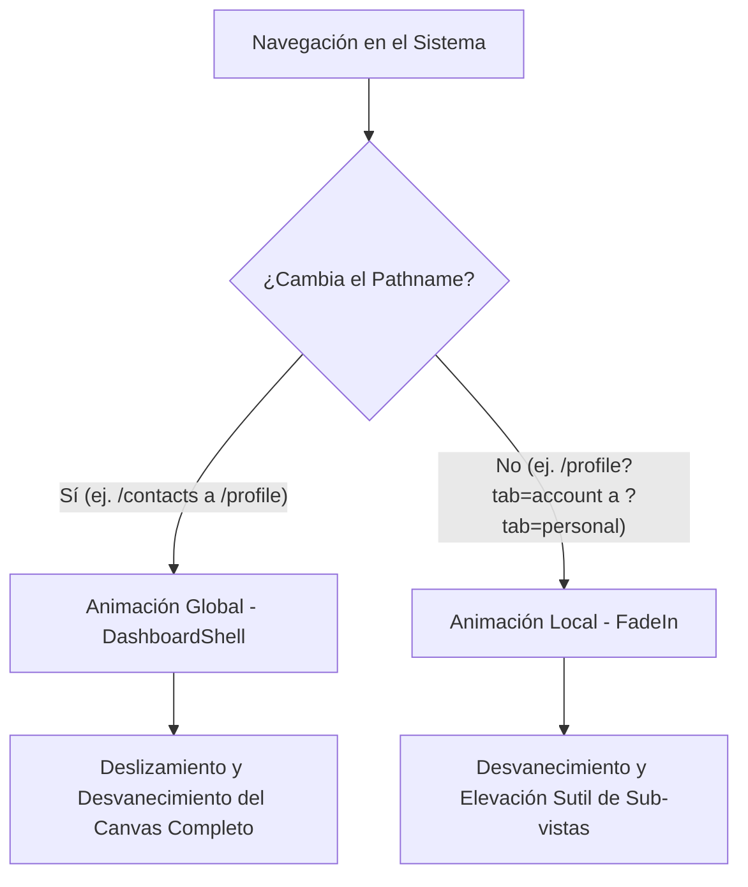

# Contrato de Arquitectura: Animaciones y Transiciones de Vista

Este contrato define las reglas de gobernanza, criterios de uso, especificaciones técnicas y la guía de referencia módulo por módulo para la aplicación de animaciones de entrada locales en todo el ecosistema de **ERPGrafico** (excluyendo vistas del POS).

---

## 1. Declaración de Misiones (Gobernanza Visual)

El sistema visual de ERPGrafico está diseñado para transmitir una sensación **premium, fluida e industrial**. Para lograr esto de forma coherente sin penalizar el rendimiento ni cansar al usuario, dividimos el manejo de transiciones en dos capas estrictas:



### Reglas Invariables (PR Reject si se violan)
1. **Cero imports directos de `framer-motion` en páginas**: Queda prohibido importar `motion` de `framer-motion` para animaciones de entrada de páginas o pestañas secundarias. Debe usarse obligatoriamente el componente compartido `<FadeIn>`.
2. **Cero duplicación de animación en páginas simples**: Las páginas que solo cambian de contenido mediante una ruta única no deben envolverse en ningún componente de animación local. La transición la realiza el [DashboardShell](file:///home/pato/Nextcloud/Pato/Aplicaciones/ERPGrafico/frontend/components/layout/DashboardShell.tsx).
3. **Respeto Absoluto a Accesibilidad (Reduced Motion)**: Toda micro-animación local o global debe integrarse con las configuraciones de accesibilidad del sistema operativo para usuarios con sensibilidad al movimiento vestibular.

---

## 2. El Componente Compartido: `<FadeIn>`

El componente [FadeIn.tsx](file:///home/pato/Nextcloud/Pato/Aplicaciones/ERPGrafico/frontend/components/shared/FadeIn.tsx) encapsula la lógica de transición optimizada para hardware, con soporte integrado de accesibilidad.

### Interfaz del Componente (`FadeInProps`)

```typescript
export interface FadeInProps {
    children: React.ReactNode
    className?: string   // Clases de Tailwind adicionales para diseño/grillas
    delay?: number       // Retardo antes de iniciar (en segundos)
    duration?: number    // Duración de la animación (por defecto 0.35s)
    yOffset?: number     // Distancia de elevación vertical (por defecto 8px)
}
```

### Ejemplo de Uso Básico (Pestañas Simples)

```tsx
import { FadeIn } from "@/components/shared"

function SalesTabView({ activeTab }: { activeTab: string }) {
    return (
        <div className="w-full">
            {activeTab === "orders" && (
                <FadeIn>
                    <OrdersTable />
                </FadeIn>
            )}
            
            {activeTab === "invoices" && (
                <FadeIn>
                    <InvoicesTable />
                </FadeIn>
            )}
        </div>
    )
}
```

### Ejemplo de Uso Avanzado (Cascada de Tarjetas / Staggered)

```tsx
import { FadeIn } from "@/components/shared"

function DashboardWidgets() {
    return (
        <div className="grid grid-cols-3 gap-4">
            <FadeIn delay={0.0}>
                <KPIWidget title="Ventas Totales" />
            </FadeIn>
            
            <FadeIn delay={0.1}>
                <KPIWidget title="Órdenes Activas" />
            </FadeIn>
            
            <FadeIn delay={0.2}>
                <KPIWidget title="Caja Chica" />
            </FadeIn>
        </div>
    )
}
```

---

## 3. Criterios Técnicos y Optimización de Rendimiento

Para asegurar que las animaciones locales se rendericen a **60-120 FPS** sin causar retardos perceptibles (*jank*), se imponen las siguientes reglas técnicas:

> [!IMPORTANT]
> **Propiedades Permitidas para Animar:**
> Únicamente se permite animar propiedades compuestas por la **GPU**: `opacity` y `transform` (desplazamientos `translateX/Y`, escala). 
> **Queda estrictamente prohibido** animar propiedades como `width`, `height`, `padding`, `margin`, `border` o `font-size`, ya que causan recalculaciones completas del flujo del documento (*CSS Reflow / Layout Thrashing*).

> [!TIP]
> **Transiciones de Salida:**
> En aplicaciones SPA complejas con alta concurrencia de datos, las animaciones de salida (`exit`) intensas bloquean la destrucción inmediata de elementos del DOM por parte de React. El componente `<FadeIn>` utiliza una salida de opacidad rápida y optimizada para asegurar que el DOM se libere al instante.

---

## 4. Evaluación Módulo por Módulo y Plan de Acción

A continuación se realiza una auditoría completa del árbol de páginas del frontend de ERPGrafico para categorizarlas bajo este contrato y definir en cuáles se debe implementar `<FadeIn>` local.

### Tabla General de Auditoría de Módulos

| Módulo / Ruta | Tipo de Navegación | Criterio de Animación Local | Estado | Archivos Clave a Modificar |
|---|---|---|---|---|
| **Mi Perfil** (`/profile`) | Pestañas y Sub-pestañas vía Query Params | **Requerido**. Mantiene el mismo pathname pero alterna sub-vistas pesadas. | 🟢 Implementado (Refactorizar a `<FadeIn>`) | `features/profile/components/ProfileView.tsx` |
| **Tablero** (`/`) | Ruta simple / Dashboards estáticos | **No Requerido**. El Shell maneja la entrada principal. | 🟢 Conforme | Ninguno |
| **Contactos** (`/contacts`) | Lista unificada con hojas colapsables | **No Requerido**. Usa Skeletons + hojas laterales dinámicas. | 🟢 Conforme | Ninguno |
| **Ventas** (`/sales`) | Pestañas múltiples (`orders`, `quotes`, `customers`) | **Requerido**. Cambia de sub-tablas pesadas sin cambiar de ruta. | 🔴 Pendiente | `app/(dashboard)/sales/page.tsx` o vistas de pestañas. |
| **Compras** (`/purchasing`) | Pestañas múltiples (`orders`, `requisitions`) | **Requerido**. Evitará el salto seco entre tablas de compras. | 🔴 Pendiente | `app/(dashboard)/purchasing/page.tsx` |
| **Inventario** (`/inventory`) | Pestañas múltiples (`products`, `adjustments`, `warehouses`) | **Requerido**. Dinamiza el cambio de fichas de bodega y productos. | 🔴 Pendiente | `app/(dashboard)/inventory/page.tsx` |
| **Tesorería** (`/treasury`) | Pestañas de movimientos y cuentas | **Requerido**. Muy útil al cambiar entre cuentas de caja y transacciones. | 🔴 Pendiente | `app/(dashboard)/treasury/page.tsx` |
| **Producción** (`/production`) | Wizard / Flujos secuenciales | **Requerido**. Para las transiciones entre fases del asistente de órdenes. | 🟡 Parcial | Componentes del Wizard de Producción. |
| **Facturación** (`/billing`) | Vistas de tarjetas y listas rápidas | **Requerido** (al cambiar tipo de vista o de tipo de documento). | 🔴 Pendiente | `app/(dashboard)/billing/page.tsx` |
| **Contabilidad** (`/accounting`) | Pestañas de libros, diarios y balances | **Requerido**. Suaviza el cambio entre el Libro Diario, Mayor y Balances. | 🔴 Pendiente | `app/(dashboard)/accounting/page.tsx` |

---

## 5. Próximos Pasos de Implementación

Para ejecutar la unificación estética módulo a módulo con el menor riesgo:

1. **Refactorizar el módulo Perfil**: Reemplazar los `<motion.div>` manuales en [ProfileView.tsx](file:///home/pato/Nextcloud/Pato/Aplicaciones/ERPGrafico/frontend/features/profile/components/ProfileView.tsx) por el nuevo componente unificado `<FadeIn>`. Esto servirá como *Proof of Concept* (Prueba de Concepto).
2. **Implementar en Ventas y Compras**: Identificar los archivos contenedores de pestañas y envolverlos en `<FadeIn>`.
3. **Auditar Rendimiento**: Monitorear las métricas de rendimiento (FPS y renderizados acumulados) tras la migración de cada módulo.
