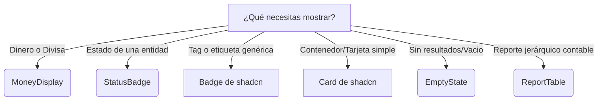
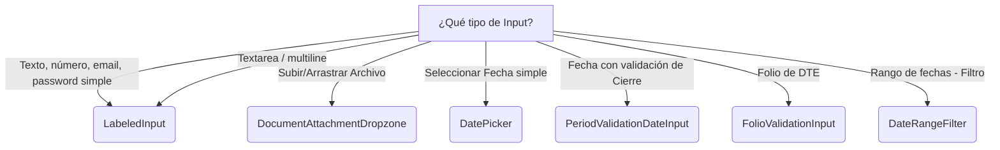

# Component Decision Tree

Use esta guía rápida para decidir qué componente de interfaz gráfica debe utilizar para resolver un problema específico. Esto garantiza consistencia visual y evita duplicación de código.

## 1. Modales y Diálogos

```mermaid
graph TD
    A[¿Qué tipo de Modal necesitas?]
    A -->|Confirmar acción (Ej. Eliminar)| B(ActionConfirmModal)
    A -->|Proceso paso a paso| C(GenericWizard)
    A -->|Completar/Adjuntar Factura| D(DocumentCompletionModal)
    A -->|Ver detalle de transacción| E(TransactionViewModal)
    A -->|Otro tipo (Custom)| F(BaseModal)
```

- **`ActionConfirmModal`**: Úsalo siempre que requieras que el usuario confirme una acción antes de ejecutar una llamada asíncrona (conecta con `onConfirm` para manejar estados de carga).
- **`BaseModal`**: Es la primitiva. Nunca uses `Dialog` de shadcn directamente, siempre envuelve en `BaseModal` para garantizar el layout con `ScrollArea` y el footer estándar.

## 2. Presentación de Datos y Contenedores



- **`MoneyDisplay`**: **Obligatorio** para montos. Nunca uses `Number.prototype.toLocaleString()` en bruto.
- **`StatusBadge`**: **Obligatorio** para el estado de las entidades (ej. `in_production`, `paid`). Lee `state-map.md`.
- **`Card` de shadcn**: Contenedor estándar. [Ver documentación oficial (component-card.md)](./component-card.md). Nunca uses wrappers propietarios y está **estrictamente prohibido** emular tarjetas usando clases utilitarias crudas (ej. `<div className={FORM_STYLES.card}>`). Usa siempre `<Card variant="...">`.

## 3. Inputs y Formularios

**Regla de entrada:** Para cualquier campo de texto o textarea simple, usa `LabeledInput`. Para casos complejos de negocio, usa las especializaciones.

> [!WARNING]
> `FORM_STYLES.label` y `FORM_STYLES.input` están **deprecated**. No usarlos en código nuevo.



- **`LabeledInput`**: Primitivo estándar. Renderiza `fieldset + legend` (patrón Notched). Soporta `as="textarea"`. Compatible con `react-hook-form` via `{...field}`. Ver [component-input.md](./component-input.md).
- **`PeriodValidationDateInput`**: Obligatorio en documentos donde la fecha impacte contabilidad o impuestos para validar si el periodo está cerrado.
- **`FolioValidationInput`**: Úsalo para prevenir folios duplicados por proveedor asíncronamente mientras el usuario tipea.

## 4. Layout de Página

- **`PageHeader`**: Para el título de la vista principal, migas de pan y acciones globales arriba a la derecha.
- **`PageTabs`**: Para navegación secundaria dentro de una página.
- **`CollapsibleSheet`**: Cuando necesites un panel lateral con contenido secundario (ej. Ver el detalle de una orden al lado de un listado).
- **Skeletons (`SkeletonShell`, `CardSkeleton`, `TableSkeleton`)**: Úsalos durante el renderizado inicial y las transiciones asíncronas para evitar el salto de layout (CLS).
