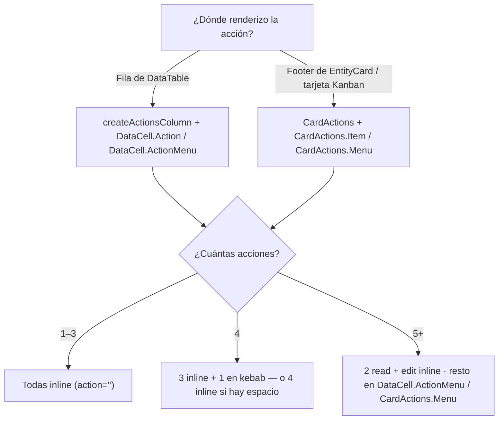
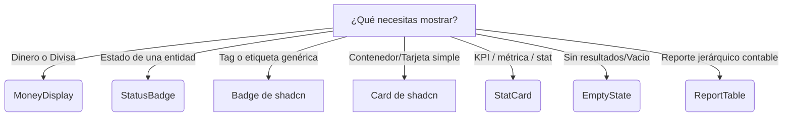
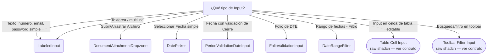
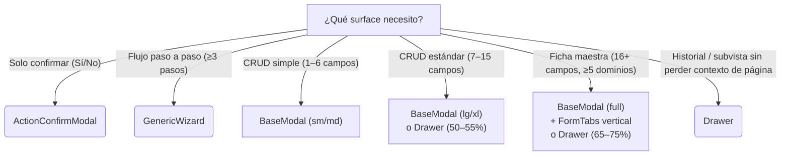

# Component Decision Tree

Use esta guía rápida para decidir qué componente de interfaz gráfica debe utilizar para resolver un problema específico. Esto garantiza consistencia visual y evita duplicación de código.

## 1. Modales y Diálogos

```mermaid
graph TD
    A[¿Qué tipo de Modal necesitas?]
    A -->|Confirmar acción (Ej. Eliminar)| B(ActionConfirmModal)
    A -->|Proceso paso a paso| C(GenericWizard)
    A -->|Completar/Adjuntar Factura| D(DocumentCompletionModal)
    A -->|Ver detalle de transacción| E["Drawer de entidad<br/>(openEntity — ADR-0028)"]
    A -->|Otro tipo (Custom)| F(BaseModal)
```

- **`ActionConfirmModal`**: Úsalo siempre que requieras que el usuario confirme una acción antes de ejecutar una llamada asíncrona (conecta con `onConfirm` para manejar estados de carga).
- **`BaseModal`**: Es la primitiva. Nunca uses `Dialog` de shadcn directamente, siempre envuelve en `BaseModal` para garantizar el layout con `ScrollArea` y el footer estándar.

## 1.5 Acciones de Fila y Tarjeta (Row & Card Actions)

> 📄 Contrato completo en **[component-row-actions.md](./component-row-actions.md)**.

Cualquier acción CRUD que aparezca en una fila de `DataTable`, en el footer de una `EntityCard` o en una tarjeta de Kanban DEBE provenir del registry cerrado **`ROW_ACTIONS`** (`@/lib/row-actions`) y renderizarse con uno de los componentes oficiales — nunca con `<Button>` o `<Popover>` hechos a mano.



- **Forma preferida:** `<DataCell.Action action="edit" onClick={…} />` — icono, tooltip y color salen del registry.
- **Acciones específicas del módulo (no CRUD):** mismo componente, pasando `icon` + `title` propios — se conservan tamaño (h-7 w-7), tooltip (delay 400ms, paleta sidebar) y `CropFrame`.
- **Apertura de modales / sheets vía URL:** usa el hook **`useEntityRouteActions`** (`?selected` edit · `?hub` CollapsibleSheet). Para ver el detalle de una entidad, `openEntity(label, id)` con `mode='view'` ([component-entity-drawers.md](./component-entity-drawers.md), ADR-0028; `?detail` quedó deprecado). Nunca uses `?id`, `?edit`, `?modal`, y reserva `?view` exclusivamente para el switch de viewMode.
- **Orden canónico (siempre):** `view → detail → hub → edit → duplicate → pay → deliver → receive → download → print → share → archive → restore → lock/unlock → annul → delete`. `annul` y `delete` siempre al final, en ese orden.
- **`annul` vs `delete`:** `annul` para documentos transaccionales (factura, OV, pago — preserva el registro para auditoría); `delete` para masters/config (categoría, almacén — borra el registro). Ambas son destructivas.
- **Confirmación destructiva obligatoria:** `annul` y `delete` SIEMPRE abren `ActionConfirmModal` con `variant="destructive"`. Nunca destruyen directo.

## 2. Presentación de Datos y Contenedores



```mermaid
graph TD
    T[¿Qué tipo de tabla?]
    T -->|CRUD con filtros/paginación/acciones| TA(DataTable variant="standalone" | "embedded")
    T -->|Tabla display simple en tabs/detalle| TB(DataTable variant="minimal")
    T -->|Líneas editables en formulario| TC(FormLineItemsTable / AccountingLinesTable)
    T -->|Reporte jerárquico contable| TD(ReportTable)
```

- **`StatusBadge`**: **Obligatorio** para el estado de las entidades (ej. `in_production`, `paid`). Lee `state-map.md`.
- **`StatCard`**: **Obligatorio** para tarjetas de métrica/resumen con label + valor. 3 variantes (default, compact, minimal), 7 acentos, trend, href, onClick. [Ver contrato completo](./component-statcard.md).
- **`Card` de shadcn**: Contenedor estándar para contenido arbitrario (formularios, charts, tablas). [Ver documentación oficial (component-card.md)](./component-card.md).

## 3. Inputs y Formularios

**Regla de entrada:** Para cualquier campo de texto o textarea simple, usa `LabeledInput`. Para casos complejos de negocio, usa las especializaciones.



- **`LabeledInput`**: Primitivo estándar. Renderiza `fieldset + legend` (patrón Notched). Soporta `as="textarea"`. Compatible con `react-hook-form` via `{...field}`. Ver [component-input.md](./component-input.md).
- **`PeriodValidationDateInput`**: Obligatorio en documentos donde la fecha impacte contabilidad o impuestos para validar si el periodo está cerrado.
- **`FolioValidationInput`**: Úsalo para prevenir folios duplicados por proveedor asíncronamente mientras el usuario tipea.
- **Table Cell Input**: `<Input>` de shadcn sin notched, dentro de `<TableCell>` en una tabla editable (spreadsheet). Ver [component-table-cell-input.md](./component-table-cell-input.md). Usar el shell `FormLineItemsTable` o `AccountingLinesTable`.
- **Toolbar Filter Input**: `<Input>` de shadcn para filtros/búsqueda en toolbars compactos. Ver sección de excepciones en [component-input.md](./component-input.md#toolbar-filter-input).

## 4. Layout de Página

- **`PageHeader`**: Para el título de la vista principal, migas de pan y acciones globales arriba a la derecha.
- **`PageTabs`**: Para navegación secundaria dentro de una página.
- **`CollapsibleSheet`**: Cuando necesites un panel lateral con contenido secundario (ej. Ver el detalle de una orden al lado de un listado).
- **`Drawer`**: Superficie modal que se despliega desde los bordes de la página. Compatible con **formularios CRUD** (create/edit) y subvistas de datos (tablas, históricos, libros mayores). Preserva el contexto visual de la página subyacente. Para formularios, usar `side="left"` y dimensionar según la tabla en [component-drawer.md](./component-drawer.md).
- **`EntityDetailPage`**: ~~Shell de página completa para rutas `[id]`.~~ **Eliminado (T-95).** Las rutas `[id]` redirigen server-side a `<list_url>?selected={id}` per ADR-0020. Ver [list-modal-edit-pattern.md](./list-modal-edit-pattern.md).
- **Skeletons (`SkeletonShell`, `CardSkeleton`, `TableSkeleton`)**: Úsalos durante el renderizado inicial y las transiciones asíncronas para evitar el salto de layout (CLS).


## 5. Formularios y Surfaces

> 📄 Documentación completa en **[component-form-patterns.md](./component-form-patterns.md)**.
> 📄 Para el patrón canónico de edición desde lista (modal + query param `?selected`), consulta **[list-modal-edit-pattern.md](./list-modal-edit-pattern.md)**.

Antes de construir un formulario, decide **qué contenedor** (surface) usar:



- **`FormTabs`**: Obligatorio en Complejo/Ficha Maestra, y en Estándar con ≥5 dominios. Horizontal para 2–4 tabs; Vertical (sawtooth) para ≥5 tabs o modal `xl`+. Ver [component-form-patterns.md §3](./component-form-patterns.md).
- **`FormSplitLayout`**: Obligatorio en modo edición para integrar `ActivitySidebar`.
- **`FormSection`**: Separador visual dentro de un tab o formulario sin tabs.
- **`FormFooter`**: **Obligatorio** en todo formulario modal. Layout de botones: danger (izquierda) + cancel/submit (derecha). Nunca `<div>` raw.
- **`Drawer`**: Para subvistas que se superponen sobre la página sin perder su contexto. Compatible con formularios CRUD y subvistas de solo lectura (tablas, históricos). Ancho recomendado: `40%–75%` según categoría del formulario (ver [component-drawer.md](./component-drawer.md)).
