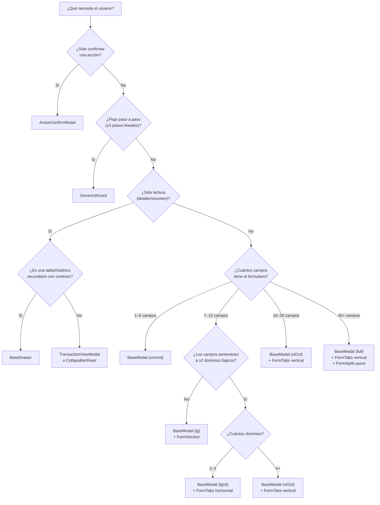
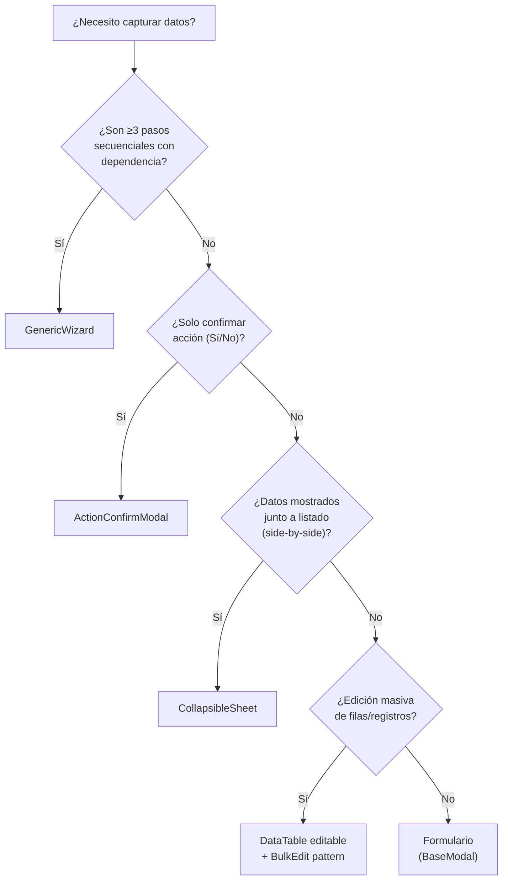

# Form Patterns & Surface Selection

Este contrato define **cuándo, cómo y en qué contenedor** renderizar formularios en ERPGrafico. Es el punto de entrada para cualquier decisión sobre la UI de captura de datos.

> **Documentos relacionados:**
> - [form-layout-architecture.md](./form-layout-architecture.md) — grids, field widths, spacing, footer (layout **interno**)
> - [component-visual-hierarchy.md](./component-visual-hierarchy.md) — tipografía de 3 capas (FormSection → Legend → Value)
> - [component-modal.md](./component-modal.md) — API de BaseModal, tamaños y variantes
> - [component-decision-tree.md](./component-decision-tree.md) — árbol de decisión de inputs individuales

---

## 1. Árbol de Decisión: ¿Qué Surface Necesito?



### Regla de oro

> **Usa siempre la surface más pequeña que contenga la información sin scroll excesivo.** Un formulario de 4 campos en un modal `xl` se siente vacío; un formulario de 20 campos en un modal `md` se siente claustrofóbico.

---

## 2. Dimensionamiento de Formularios

| Categoría | Campos | Modal `size` | Grid | Tabs | Ejemplo real |
|:---|:---|:---|:---|:---|:---|
| **Micro** | 1–3 | `sm` / `xs` | N/A (stack) | **Nunca** | `AddPartnerModal`, `InitialCapitalModal` |
| **Simple** | 4–6 | `md` | `grid-cols-4` | **Nunca** | `TransferModal`, `CategoryForm`, `TreasuryAccountModal` |
| **Estándar** | 7–15 | `lg` | `grid-cols-4` | **Opcional** horiz. si 2–4 dominios. **Obligatorio** si ≥5 dominios | `PricingRuleForm`, `EmployeeFormModal`, `WarehouseForm` |
| **Complejo** | 16–30 | `xl` / `2xl` | `grid-cols-4` | **Obligatorio** vertical + `h-[90vh]` | `UserForm`, `ContactModal`, `BOMFormModal` |
| **Ficha Maestra** | 30+ | `2xl` / `full` | `grid-cols-12` | **Obligatorio** vertical + `h-[90vh]` | `ProductForm`, `CompanySettingsView` |

### Escalamiento Create → Edit

Un formulario **puede crecer** de tamaño entre modo creación y edición:

```tsx
// Patrón estándar: más espacio en edición para acomodar el sidebar
<BaseModal
    size={initialData ? "xl" : "lg"}
    // ...
>
```

| Modo | Surface típica | Sidebar | Razón |
|:---|:---|:---|:---|
| **Creación** | `lg` | No | Foco en completar rápido |
| **Edición** | `xl` | `FormSplitLayout` + `ActivitySidebar` | Contexto histórico y auditoría |

---

## 3. Cuándo Usar Tabs (FormTabs)

### Regla: ¿Necesito tabs?

| Señal | Decisión |
|:---|:---|
| Sin dominios diferenciados (todo el contenido pertenece a 1 dominio) | **Nunca** — usar `FormSection` si hay ≥2 sub-grupos |
| Formulario Micro o Simple (1–6 campos) | **Nunca** — independientemente de los dominios |
| Formulario Estándar con 2–4 dominios lógicos | **Opcional** — `FormTabs` horizontal si la densidad lo justifica |
| Formulario Estándar con ≥5 dominios lógicos | **Obligatorio** — `FormTabs` (horizontal) |
| Formulario Complejo (16–30 campos) | **Obligatorio** — `FormTabs` vertical |
| Ficha Maestra (30+ campos) | **Obligatorio** — `FormTabs` vertical |
| Tabs con contenido denso (tablas, grids embebidos) | **Obligatorio** — `FormTabs` vertical |
| Modal ≥ `xl` con sidebar (`FormSplitLayout`) | **Obligatorio** — `FormTabs` vertical |

### ¿Qué es un "dominio lógico"?

Un dominio agrupa campos conceptualmente relacionados. Ejemplos:

| Entidad | Dominios |
|:---|:---|
| **Producto** | General, Fabricación, Logística, Comercial, Reglas, Variantes |
| **Contacto** | Perfil, Ventas (cliente), Compras (proveedor), Crédito |
| **Usuario** | Datos Generales, Permisos |
| **Regla de Precio** | General/Alcance, Condiciones, Acciones, Vigencia |

### Orientación

| Orientación | Cuándo | Requisitos técnicos |
|:---|:---|:---|
| **Horizontal** | 2–4 tabs, contenido ligero, modal `lg` | Ninguno especial |
| **Vertical (Sawtooth)** | ≥5 tabs, contenido denso, modal `xl`+, o cualquier Complejo/Ficha Maestra | `allowOverflow={true}`, `hideScrollArea={true}`, `contentClassName="p-0"` en BaseModal |

### Configuración por orientación

#### Vertical (Sawtooth Rail)

```tsx
<BaseModal
    open={open}
    onOpenChange={onOpenChange}
    title="Ficha de Entidad"
    size="xl"
    headerClassName="sr-only"     // Ocultar header de BaseModal
    hideScrollArea={true}         // FormTabs maneja su propio scroll
    allowOverflow={true}          // Permitir que el riel sobresalga
    contentClassName="p-0"
    footer={/* ... */}
>
    <FormTabs
        items={tabItems}
        value={activeTab}
        onValueChange={setActiveTab}
        orientation="vertical"
        header={headerSlot}       // Título movido aquí
        footer={footerSlot}       // Opcional: footer dentro de tabs
    >
        <FormTabsContent value="general">...</FormTabsContent>
        <FormTabsContent value="config">...</FormTabsContent>
    </FormTabs>
</BaseModal>
```

#### Horizontal (Pill Group)

```tsx
<BaseModal
    open={open}
    onOpenChange={onOpenChange}
    title="Configuración"
    size="lg"
    footer={/* ... */}
>
    <FormTabs
        items={tabItems}
        value={activeTab}
        onValueChange={setActiveTab}
        orientation="horizontal"
    >
        <FormTabsContent value="tab1">...</FormTabsContent>
        <FormTabsContent value="tab2">...</FormTabsContent>
    </FormTabs>
</BaseModal>
```

---

## 4. Contextos de Uso

Cada formulario opera en un **contexto** que determina su comportamiento, surface, y acciones disponibles.

| Contexto | Surface típica | Comportamiento | Footer actions | Sidebar |
|:---|:---|:---|:---|:---|
| **Creación** | BaseModal (`lg`) | `form.reset()` al abrir, sin datos previos | `CancelButton` + `SubmitButton "Crear {Entidad}"` | No |
| **Edición** | BaseModal (`xl`) | Pre-fill desde `initialData`, dirty tracking | `CancelButton` + `SubmitButton "Guardar Cambios"` | `FormSplitLayout` + `ActivitySidebar` |
| **Ficha maestra** | BaseModal (`full`) | Tabs + insights + sidebar, mixta edición/lectura | `CancelButton` + `ActionSlideButton` | `FormSplitLayout` + `ActivitySidebar` |
| **Configuración** | Page-level o BaseModal (`xl`) | Settings globales, cambios aplican a todo el sistema | `CancelButton` + `SubmitButton "Aplicar"` | Opcional |
| **Quick edit** | Inline (row/popover) | Sin modal, edición in-situ | Auto-save o botón confirm inline | No |

### Patrones de Inicialización

```tsx
// Creación: reset limpio
useEffect(() => {
    if (open && !initialData) {
        form.reset(defaultValues)
    }
}, [open])

// Edición: pre-fill
useEffect(() => {
    if (open && initialData) {
        form.reset(mapInitialDataToFormValues(initialData))
    }
}, [open, initialData?.id])

// Ficha maestra: reset + fetch adicional
useEffect(() => {
    if (open) {
        if (initialData) {
            form.reset(mapInitialDataToFormValues(initialData))
            fetchRelatedData(initialData.id)  // Insights, pricing rules, etc.
        } else {
            form.reset(defaultValues)
        }
    }
}, [open, initialData?.id])
```

---

## 5. Cuándo Derivar a Otro Componente

No todo captura de datos es un formulario. Evalúa estas señales:



| Señal | En vez de formulario, usa… | Ejemplo |
|:---|:---|:---|
| ≥3 pasos secuenciales con dependencia entre ellos | `GenericWizard` | `SalesCheckoutWizard`, `FiscalYearClosingWizard`, `MovementWizard` |
| Solo confirmar una acción (destructiva o no) | `ActionConfirmModal` | Eliminar entidad, Anular documento |
| Mostrar detalle de un documento/entidad | `TransactionViewModal` | Ver factura, ver pago |
| Mostrar lista/histórico auxiliar con contexto | `BaseDrawer` | `PartnerLedgerModal`, `PayrollDetailSheet`, `SalesOrdersModal` |
| Panel secundario de acciones junto a listado | `CollapsibleSheet` | `OrderActionPanel` |
| Edición masiva de múltiples filas | `DataTable` editable + pattern Bulk | `BulkVariantEditForm` |
| Completar un documento con folio + adjunto | `DocumentCompletionModal` | Completar factura |

### Wizard vs. Form con Tabs

| Criterio | Wizard | Form con Tabs |
|:---|:---|:---|
| Los pasos son **secuenciales** y el paso N depende de N-1 | ✅ Wizard | ❌ |
| El usuario puede navegar libremente entre secciones | ❌ | ✅ Tabs |
| Se valida progresivamente (gate por paso) | ✅ Wizard | ❌ |
| Todo se envía en un solo submit al final | Ambos | ✅ Tabs |
| Hay una pantalla de "éxito" / resumen final | ✅ Wizard | ❌ |

---

## 6. Composición de Building Blocks

Jerarquía de componentes y cómo se ensamblan:

```
Surface (BaseModal | Page)
  └─ FormTabs (si ≥2 dominios)
  │    ├─ header (título + badge de entidad)
  │    ├─ FormTabsContent × N
  │    │    └─ FormSplitLayout (si edit mode con audit)
  │    │         ├─ form (main area, scrollable)
  │    │         │    ├─ FormSection × N (separadores de dominio)
  │    │         │    │    └─ grid (grid-cols-4 o grid-cols-12)
  │    │         │    │         └─ LabeledInput | LabeledContainer | Selector
  │    │         │    └─ FormSection ...
  │    │         └─ ActivitySidebar (w-72, border-l proveído por FormSplitLayout, solo edit mode)
  │    └─ footer (FormFooter | FormTabs footer slot)
  │         └─ CancelButton + SubmitButton | ActionSlideButton
  └─ (Sin FormTabs)
       └─ FormSplitLayout (si edit mode)
            ├─ form
            │    └─ FormSection × N → grid → inputs
            └─ sidebar
```

### Componentes de estructura del formulario

| Componente | Propósito | Documentación |
|:---|:---|:---|
| `FormTabs` / `FormTabsContent` | Navegación por dominios lógicos | [component-contracts.md §FormTabs](./component-contracts.md) |
| `FormSplitLayout` | Layout form + sidebar de auditoría | [form-layout-architecture.md §5](./form-layout-architecture.md) |
| `ActivitySidebar` | Historial de cambios — solo en edit mode, solo en sidebar de `FormSplitLayout` | [form-layout-architecture.md §5](./form-layout-architecture.md) |
| `FormSection` | Separador visual entre grupos de campos | [form-layout-architecture.md §5](./form-layout-architecture.md) |
| `FormFooter` | Layout del footer (left-actions + right-actions) | [form-layout-architecture.md §7](./form-layout-architecture.md) |

### Componentes de campo

| Componente | Propósito | Documentación |
|:---|:---|:---|
| `LabeledInput` | Texto, número, email, textarea | [component-input.md](./component-input.md) |
| `LabeledContainer` | Wrapper notched para selects, switches, custom | [component-input.md](./component-input.md) |
| `LabeledSelect` | Select nativo con notched border | [component-input.md](./component-input.md) |
| `LabeledSwitch` | Toggle con label y descripción | [component-input.md](./component-input.md) |
| `DatePicker` / `PeriodValidationDateInput` | Fechas | [component-datepicker.md](./component-datepicker.md) |
| Selectors (`ProductSelector`, etc.) | Búsqueda de entidades | [component-selectors.md](./component-selectors.md) |

---

## 7. Indicador de Errores en Tabs

Cuando un formulario con tabs tiene errores de validación, `FormTabs` los muestra automáticamente a través de la prop `hasErrors`:

```tsx
const tabItems: FormTabItem[] = [
    {
        value: "general",
        label: "General",
        icon: Package,
        hasErrors: !!tabErrors['general'],  // Dot rojo en la pestaña
    },
    // ...
]
```

### Mapeo de campos a tabs

Cada formulario debe implementar una función que mapee errores del schema a pestañas:

```tsx
const getTabsWithErrors = () => {
    const errors = form.formState.errors
    const tabErrors: Record<string, boolean> = {}

    const generalFields = ['name', 'code', 'category']
    tabErrors['general'] = generalFields.some(f => errors[f])

    const configFields = ['min_quantity', 'operator']
    tabErrors['config'] = configFields.some(f => errors[f])

    return tabErrors
}
```

En `onSubmitError`, navegar automáticamente al primer tab con errores:

```tsx
const onSubmitError = (errors: FieldErrors) => {
    const tabsWithErrors = getTabsWithErrors()
    const firstErrorTab = Object.keys(tabsWithErrors).find(k => tabsWithErrors[k])
    if (firstErrorTab) setActiveTab(firstErrorTab)
}
```

---

## Forbidden Patterns

- ❌ **Tabs manuales** — Nunca implementar navegación por tabs de forma artesanal. Siempre usar `FormTabs`.
- ❌ **`Dialog` directo** — Siempre envolver en `BaseModal`.
- ❌ **Formulario sin Zod** — Todos los formularios usan `zodResolver` + `react-hook-form`.
- ❌ **Footer sin `FormFooter`** — Todo formulario modal **SIEMPRE** usa `FormFooter` en la prop `footer` de `BaseModal`. Nunca un `<div>` raw. Los modales de solo lectura (sin form) pueden usar `<Button>Cerrar</Button>` directo.
- ❌ **Sidebar ad-hoc** — Usar `FormSplitLayout` para el patrón form + sidebar.
- ❌ **Modal `full` para formularios simples** — Respetar la tabla de dimensionamiento.
- ❌ **Card envolvente en formularios** — No envolver el contenido de un formulario dentro de un `<div>` con `border`, `rounded-lg`, `bg-muted`, `shadow` etc. El `BaseModal` ya proporciona el contenedor visual. Un card extra es ruido y herencia de patrones legacy.
- ❌ **`FormSection` redundante en formularios simples** — Si el formulario tiene ≤6 campos homogéneos (todos del mismo dominio lógico), NO añadir un `FormSection`. El título del modal/tab ya provee el contexto necesario. Ver [form-layout-architecture.md §5](./form-layout-architecture.md) para la guía completa.
