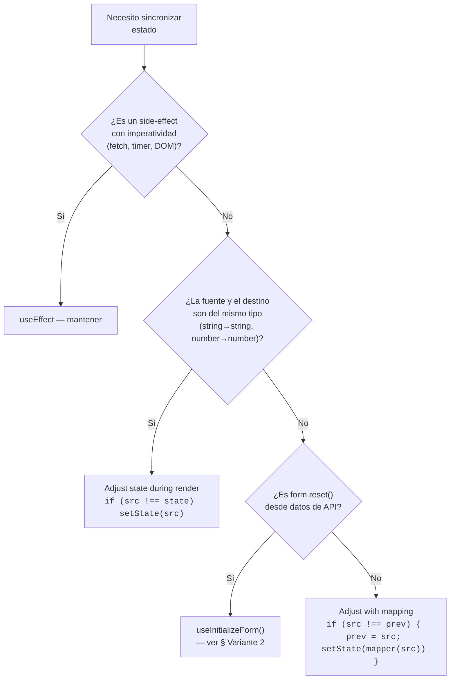

# State Synchronization — Adjust State During Render

> **Documentos relacionados:**
> - [ADR-0051](../10-architecture/adr/0051-adjust-state-during-render.md) — decisión arquitectural
> - [component-form-patterns.md](./component-form-patterns.md) — formularios, surfaces, initialization
> - [autosave-contract.md](./autosave-contract.md) — autosave + `form.reset()` interaction
> - [hook-contracts.md](./hook-contracts.md) — `useInitializeForm` canonizado

---

## 1. El Problema: Cascading Renders

### Por qué `useEffect` + `setState` es problemático

```tsx
// ❌ ANTIPATRÓN — setState sincrónico en effect body
useEffect(() => {
    if (settings && !initialized) {
        form.reset(settings)
        setInitialized(true)    // ← setState sincrónico
    }
}, [settings, form, initialized])
```

Flujo resultante:

```
render → useEffect → setInitialized(true) → re-render
                                              → useEffect corre de nuevo
                                              → (guard !initialized lo detiene)
                                              → 1 re-render extra INNECESARIO
```

React no puede batchear `setState` llamado en el body de un `useEffect` con el render que lo originó. Siempre causa al menos 1 render adicional.

### Por qué el React Compiler lo marca como error

React Compiler (eslint) no puede probar estáticamente que el guard `if (!initialized)` previene un loop infinito. Si `settings` cambia en cada refetch de TanStack Query (nueva referencia), el effect se ejecuta cada vez. El compiler exige que **todo `setState` esté fuera del body de un effect** o envuelto en un event handler / timeout / promesa.

---

## 2. El Patrón Canónico: "Adjust State During Render"

### Mecánica

```tsx
// ✅ PATRÓN CANÓNICO — setState durante render
const [prevValue, setPrevValue] = useState(initialValue)

if (incomingValue !== prevValue) {
    setPrevValue(incomingValue)
    setLocalState(incomingValue)   // ← ajuste sincrónico, permitido
}
```

**Por qué funciona**: Los `setState` llamados durante la fase de render son batcheados por React dentro del mismo render. No hay ciclo render→effect→render. React simplemente continúa renderizando con el estado actualizado.

**Regla de oro**: Si puedes expresar la sincronización como `if (prop !== state) setState(prop)`, hazlo durante render, no en un effect.

### Cuándo usar

| Señal | Usar adjust-during-render | Usar useEffect |
|-------|--------------------------|----------------|
| Sincronizar props → estado local | ✅ | ❌ |
| Sincronizar URL params → estado local | ✅ | ❌ |
| Inicializar form desde datos del servidor | ✅ | ❌ |
| Fetch de datos | ❌ | ✅ |
| Subscriptions / WebSocket | ❌ | ✅ |
| Analytics / logging | ❌ | ✅ |
| Timers / intervals | ❌ | ✅ |
| DOM manual (focus, scroll) | ❌ | ✅ |

### Diagrama de decisión



---

## 3. Variante 1: Props → State (render-aware sync)

### Cuándo

Un componente recibe una prop y necesita mantener un estado local derivado que se actualiza cuando la prop cambia, pero que el usuario puede modificar localmente (ej: valor de input controlado, estado de UI efímero, o estado que debe resetearse al abrir/cerrar).

### Patrón existente en el proyecto

**WorkOrderWizard** (`frontend/features/production/components/WorkOrderWizard.tsx`):

```tsx
const [prevMode, setPrevMode] = useState(mode)
const [prevOpen, setPrevOpen] = useState(open)

if (mode !== prevMode || open !== prevOpen) {
    setPrevMode(mode)
    setPrevOpen(open)
    setLocalOrderId(open && mode.kind === 'manage' ? mode.orderId : null)
    if (open) { /* reset creation flow state */ }
}
```

**ActionConfirmModal** (`frontend/components/shared/ActionConfirmModal.tsx`):

```tsx
const [prevOpen, setPrevOpen] = useState(open)
if (open !== prevOpen) {
    setPrevOpen(open)
    if (open) setReason("")
}
```

### Template canónico

```tsx
interface Props {
    open: boolean
    itemId: number | null
}

function MyComponent({ open, itemId }: Props) {
    const [prevOpen, setPrevOpen] = useState(open)
    const [localId, setLocalId] = useState<number | null>(null)

    // Adjust state during render — sincronización libre de cascada
    if (open !== prevOpen) {
        setPrevOpen(open)
        if (open) {
            setLocalId(itemId)
            // resetear cualquier otro estado efímero
        } else {
            setLocalId(null)
        }
    }

    // Resto del componente...
}
```

---

## 4. Variante 2: Server Data → Form (`useInitializeForm`)

### Cuándo

Un panel de configuración (settings) carga datos vía TanStack Query y debe inicializar un `react-hook-form`. Es el escenario más común en el proyecto (≥10 ocurrencias en `UnifiedAccountsView.tsx`).

### Hook canónico

Ver [hook-contracts.md §useInitializeForm](./hook-contracts.md#useinitializeformtdata-tform-).

```tsx
useInitializeForm({
    form,
    data: settings,
    mapData: (s) => ({
        default_revenue_account: s.default_revenue_account?.toString() ?? null,
        default_service_revenue_account: s.default_service_revenue_account?.toString() ?? null,
    }),
})
```

### ¿Qué reemplaza?

```diff
- const [initialized, setInitialized] = useState(false)
- useEffect(() => {
-     if (settings && !initialized) {
-         form.reset({ /* mapped */ })
-         setInitialized(true)
-     }
- }, [settings, form, initialized])
+ useInitializeForm({ form, data: settings, mapData })
```

### Interacción con `useAutoSaveForm`

`useInitializeForm` llama `form.reset()` **durante render**, no en un effect. Esto es seguro porque `form.reset()` en RHF no dispara `form.watch()` síncronamente en la misma pila. El `isResettingRef` de `useAutoSaveForm` protege contra saves fantasma en el siguiente tick.

---

## 5. Variante 3: URL → State (Derivación Directa)

### Cuándo

Un estado local es un reflejo directo de un query param de la URL. No hay transformación ni lógica intermedia.

### Regla

Si el estado se puede **derivar** del query param, no existe como `useState`. Se lee directamente de `searchParams`.

```tsx
// ✅ DERIVACIÓN DIRECTA
const searchParams = useSearchParams()
const router = useRouter()
const pathname = usePathname()

const selectedId = searchParams.get('selected')         // string | null
const isNewModalOpen = searchParams.get("modal") === "new"  // boolean

// ❌ NO HACER — useState + useEffect para derivar de URL
const [isOpen, setIsOpen] = useState(searchParams.get("modal") === "new")
useEffect(() => { setIsOpen(searchParams.get("modal") === "new") }, [searchParams])
```

#### Excepción: estado transicional

Cuando se necesita un estado que persiste más allá del query param (ej: "hub se abrió alguna vez aunque ahora esté cerrado"), se puede usar un ref:

```tsx
// ✅ ESTADO TRANSICIONAL — ref que NO causa re-render
const hubEverOpenedRef = useRef(false)
if (isHubOpen && selectedId) hubEverOpenedRef.current = true
if (hubEverOpenedRef.current && !isHubOpen && selectedId) {
    // limpiar URL — mover a callback, no a effect
    onHubClose?.()
}
```

### Hooks canónicos existentes

| Hook | Propósito | Documentación |
|------|-----------|---------------|
| `useSelectedEntity` | `?selected=<id>` → fetch + entity | `list-modal-edit-pattern.md` |
| `useViewMode` | `?view=<mode>` → persist + URL | `component-datatable-views.md` |

---

## 6. Migración: Cómo Refactorizar los 3 Escenarios

### Escenario A: Form initialization (10 ocurrencias)

**Antes:**
```tsx
const [initialized, setInitialized] = useState(false)

useEffect(() => {
    if (settings && !initialized) {
        form.reset({ /* mapped values */ })
        setInitialized(true)
    }
}, [settings, form, initialized])
```

**Después:**
```tsx
useInitializeForm({
    form,
    data: settings,
    mapData: (s) => ({
        default_revenue_account: s.default_revenue_account?.toString() ?? null,
    }),
})
```

### Escenario B: URL param → local state (6 ocurrencias)

**Antes:**
```tsx
const [hubEverOpened, setHubEverOpened] = useState(false)

useEffect(() => {
    if (isHubOpen && selectedId) setHubEverOpened(true)
}, [isHubOpen, selectedId])
```

**Después:**
```tsx
// Derivar directamente — estado transicional con ref si necesario
const hubEverOpened = isHubOpen && !!selectedId

// Si necesita limpiar URL al cerrar, mover a callback onClose del hub
```

### Escenario C: Props → local state (2 ocurrencias)

**Antes:**
```tsx
const [dialogOpen, setDialogOpen] = useState(isNewModalOpen)

useEffect(() => {
    setDialogOpen(isNewModalOpen)
}, [isNewModalOpen])
```

**Después:**
```tsx
// Si no hay diferencia entre prop y state, derivar directamente
const dialogOpen = isNewModalOpen

// Si necesita estado "sucia" (el usuario puede cerrar pero queremos tracking),
// usar adjust-during-render con ref
```

---

## 7. Forbidden Patterns

- ❌ **`useEffect { setState(...) }`** para sincronizar props/URL → estado local. Usar adjust-during-render o derivación directa.
- ❌ **`useEffect { form.reset(...) }`** para inicializar formularios. Usar `useInitializeForm` o adjust-during-render.
- ❌ **`useState + useEffect` para derivar de `searchParams`**. Leer `searchParams` directamente.
- ❌ **`useEffect { setFlag(true) }`** como guard de inicialización. Usar ref o eliminar el flag si es derivable.
