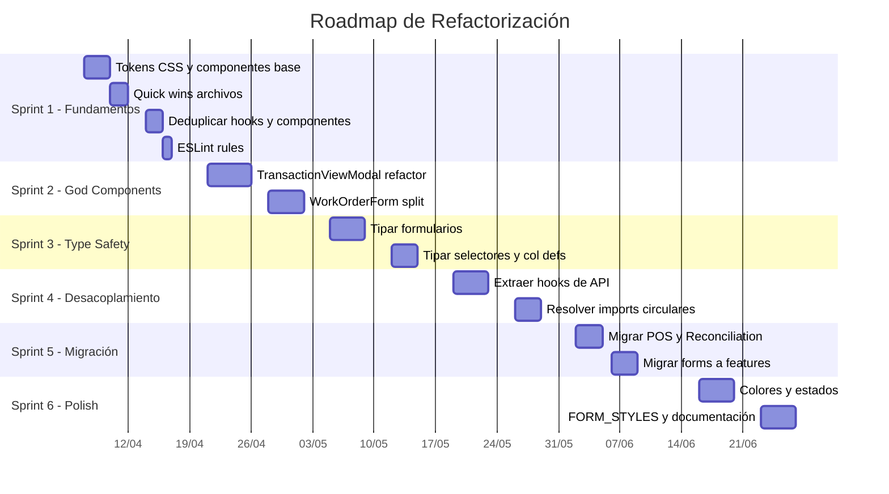

# Roadmap de Refactorización — ERP Frontend

> **Basado en:** [Auditoría de Componentes](file:///c:/Users/patox/Nextcloud/Pato/Aplicaciones/ERPGrafico/docs/component-audit.md)  
> **Fecha:** 2026-04-01  
> **Problemas totales:** 52 issues + 10 patrones de governance  
> **Estimación total:** ~6 sprints (12 semanas, ~114h)

---

## Visión General

> [!IMPORTANT]
> **Orden de ejecución obligatorio.** Cada sprint depende del anterior. No empezar Sprint 5 (migración) sin Sprint 4 (desacoplamiento), ni Sprint 6 (colores) sin Sprint 1 (tokens CSS).

---

## Sprint 1 — Fundamentos y Quick Wins (Semanas 1-2, ~14h)

> **21 issues resueltos.** Establece infraestructura base, limpia deuda trivial y configura protecciones.

### 1.1 Infraestructura de Design System (~7h)

| # | Tarea | Issues | Esfuerzo |
|---|-------|--------|----------|
| 1 | Definir tokens semánticos CSS en `globals.css`: `--success`, `--warning`, `--info` + foregrounds. Extender Tailwind para `text-success`, `bg-warning/10`, etc. | U1 base | 2h |
| 2 | Crear `<EmptyState icon title description action />` en `components/shared/` | Governance Empty | 2h |
| 3 | Crear `<StatusBadge status="active\|pending\|..." />` con mapping centralizado `status → color` usando tokens semánticos | Governance Badges | 2h |
| 4 | Crear helper `showApiError(error)` wrapper para `toast.error` con formato unificado de errores API | Governance Notif, T9 base | 1h |

### 1.2 Quick Wins — Mover Archivos (~2h)

| # | Tarea | Issues | Esfuerzo |
|---|-------|--------|----------|
| 5 | `components/app-sidebar.tsx` → `components/layout/`. Actualizar imports | C2 | 15m |
| 6 | `ui/IndustrialCard.tsx`, `ui/LoadingFallback.tsx`, `ui/MoneyDisplay.tsx` → `components/shared/`. Actualizar imports | C1 | 30m |
| 7 | `features/credits/BlacklistView.tsx` y `CreditPortfolioView.tsx` → `features/credits/components/` | C3 | 15m |
| 8 | Crear `components/ui/index.ts` barrel export para primitivos shadcn | Governance | 30m |
| 9 | Mover `STYLE_GUIDE.md` de `components/ui/` → `docs/style-guide.md` | C7 | 5m |
| 10 | Limpiar import order en `PageHeader.tsx` (framer-motion inline) | PageHeader | 5m |
| 11 | Eliminar doble export en `LoadingFallback.tsx` y `TransactionViewModal.tsx` | C4, C5 | 10m |

### 1.3 Deduplicación (~3h)

| # | Tarea | Issues | Esfuerzo |
|---|-------|--------|----------|
| 12 | Eliminar `hooks/useTreasuryAccounts.ts` → migrar consumidores a `features/treasury/hooks/` | D4 | 20m |
| 13 | Eliminar `hooks/useAccountingAccounts.ts` → unificar con `features/accounting/hooks/useAccounts.ts` | D5 | 30m |
| 14 | Unificar `FacetedFilter`: eliminar `ui/data-table-faceted-filter.tsx`, actualizar DataTable para usar `shared/FacetedFilter` | D1 | 1h |
| 15 | Unificar `PageTabs` + `ServerPageTabs` → un componente con prop `server?: boolean` | D6 | 45m |
| 16 | Eliminar `app/(dashboard)/sales/orders/components/OrderHubStatus.tsx` duplicado (mantener `features/orders/`) | D7, N5 | 15m |

### 1.4 Protecciones ESLint (~1h)

| # | Tarea | Issues | Esfuerzo |
|---|-------|--------|----------|
| 17 | ESLint `@typescript-eslint/no-explicit-any` severity `warn` | T1-T10 prevención | 30m |
| 18 | ESLint `no-restricted-imports`: prohibir `@/lib/api` en `components/**` | A1 prevención | 20m |
| 19 | Eliminar path aliases `~components`, `~features` no usados de `tsconfig.json` | N7 | 10m |

---

## Sprint 2 — God Components (Semanas 3-4, ~23h)

> **3 issues críticos resueltos.** Descompone los componentes más complejo y peligrosos.

### 2.1 TransactionViewModal (756 líneas → ~6 archivos, ~15h)

| # | Tarea | Issues | Esfuerzo |
|---|-------|--------|----------|
| 1 | Crear hook `useTransactionData({ type, id, enabled })` — extraer fetch + endpoint map de 14 rutas | A2 fetch | 3h |
| 2 | Crear hook `useNavigationHistory(initialType, initialId)` — extraer historial de navegación | A2 routing | 1h |
| 3 | Crear `TransactionHeader.tsx` sub-componente (~60 líneas de header) | A2 composición | 1.5h |
| 4 | Crear `TransactionContent.tsx` dispatcher + sub-componentes por tipo (`InvoiceView`, `PaymentView`, `OrderView`) | A2 composición | 4h |
| 5 | Reemplazar import `ActivitySidebar` por slot `sidebarSlot?: ReactNode` | A2, A9 parcial | 1h |
| 6 | Reemplazar import `PaymentForm` por callback `onCreatePayment` | A2 | 30m |
| 7 | Tipar `TransactionData` con interfaces discriminadas por tipo (eliminar `[key: string]: unknown`) | T10 | 1.5h |
| 8 | Reemplazar 50+ colores hardcoded en transaction-modal sub-componentes | U1 parcial | 2h |

> Referencia: [TransactionViewModal.refactor.tsx](file:///c:/Users/patox/Nextcloud/Pato/Aplicaciones/ERPGrafico/docs/examples/TransactionViewModal.refactor.tsx)

### 2.2 WorkOrderForm (66KB → ~8 archivos, ~8h)

| # | Tarea | Issues | Esfuerzo |
|---|-------|--------|----------|
| 9 | Analizar estructura interna y definir puntos de corte | — | 1h |
| 10 | Extraer sub-componentes: `WorkOrderBasicInfo`, `WorkOrderMaterials`, `WorkOrderStages`, `WorkOrderCosts` (patrón ProductForm) | WOF God | 5h |
| 11 | Mover todo a `features/production/components/forms/` con barrel export | WOF ubicación | 1h |
| 12 | Tipar `initialData` con interface derivada del Zod schema | T1 parcial | 1h |

---

## Sprint 3 — Type Safety (Semanas 5-6, ~18h)

> **9 issues de tipado resueltos.** Elimina `any` sistémico.

### 3.1 Formularios — Tipar `initialData` (~9h)

| # | Tarea | Issues | Esfuerzo |
|---|-------|--------|----------|
| 1 | Crear `types/forms.ts` con interfaces base: `FormMode`, `FormPayload<T>` | T1 infra | 30m |
| 2 | Tipar `PaymentForm`: `initialData?: PaymentFormData` | T1, T3 | 45m |
| 3 | Tipar `ProductForm` + sub-componentes (`ProductVariantsTab`, `ProductCustomFieldsTab`, `ProductPricingTab`) | T1, T5 | 2h |
| 4 | Tipar `JournalEntryForm`, `AccountForm`, `BankJournalForm` | T1 | 1.5h |
| 5 | Tipar `PurchaseOrderForm`, `CategoryForm`, `WarehouseForm`, `ServiceContractForm` | T1 | 1.5h |
| 6 | Tipar `UserForm`, `PricingRuleForm`, `CustomFieldTemplateForm`, `TransactionNumberForm`, `GroupForm` | T1 | 1.5h |
| 7 | Tipar `VariantQuickEditForm`: `variant: Variant`, `onSaved: (v: Variant) => void` | T4 | 30m |
| 8 | Tipar `BulkVariantEditForm` | T5 parcial | 30m |

### 3.2 Selectores — Eliminar `any` (~5h)

| # | Tarea | Issues | Esfuerzo |
|---|-------|--------|----------|
| 9 | Crear `types/entities.ts`: `Product`, `Account`, `Contact`, `WorkOrder`, `TreasuryAccount` | T2 infra | 1h |
| 10 | Tipar `ProductSelector`: reemplazar 17x `any` con `Product` | T2 | 1.5h |
| 11 | Tipar `AccountSelector`: reemplazar 5x `any` con `Account` | T2 | 30m |
| 12 | Tipar `AdvancedContactSelector`, `AdvancedSaleOrderSelector`, `AdvancedWorkOrderSelector` | T2 | 1h |
| 13 | Tipar `TreasuryAccountSelector`, `UserSelector`, `GroupSelector`, `UoMSelector` | T2 | 1h |

### 3.3 Column Defs y Error Handling (~4h)

| # | Tarea | Issues | Esfuerzo |
|---|-------|--------|----------|
| 14 | Tipar column defs en `TreasuryAccountsView` (12x `any`) | T6 | 45m |
| 15 | Tipar column defs en `TerminalBatchesManagement` | T7 | 45m |
| 16 | Tipar handlers en `WorkflowSettings` | T8 | 30m |
| 17 | Crear `ApiError` type guard + reemplazar ~20x `catch (error: any)` → `catch (error: unknown)` | T9 | 2h |

---

## Sprint 4 — Desacoplamiento API (Semanas 7-8, ~16h)

> **9 issues de acoplamiento resueltos.** Separa presentación de datos.

### 4.1 Extraer Hooks de API desde Selectores (~7h)

| # | Tarea | Issues | Esfuerzo |
|---|-------|--------|----------|
| 1 | Crear `hooks/useAccountSearch.ts` — extraer fetch de `AccountSelector` | A1 | 1h |
| 2 | Crear `hooks/useProductSearch.ts` — extraer 3 queries de `ProductSelector` | A1 | 2h |
| 3 | Crear `hooks/useContactSearch.ts` — extraer fetch de `AdvancedContactSelector` | A1 | 1h |
| 4 | Extraer fetch de `GroupSelector`, `UserSelector`, `TreasuryAccountSelector`, `AdvancedWorkOrderSelector`, `AdvancedSaleOrderSelector` | A1 | 3h |

### 4.2 Extraer Hooks de API desde Shared (~2h)

| # | Tarea | Issues | Esfuerzo |
|---|-------|--------|----------|
| 5 | `CommentSystem.tsx` → `useComments` hook | A1 | 1h |
| 6 | `DataManagement.tsx` → callback props | A1 | 30m |
| 7 | `DocumentCompletionModal.tsx` → `onComplete` callback | A1 | 30m |

### 4.3 Resolver Imports Circulares (~7h)

| # | Tarea | Issues | Esfuerzo |
|---|-------|--------|----------|
| 8 | `AdvancedContactSelector` → `ContactModal`: pasar via render prop o lazy import | A3 | 1h |
| 9 | `CostCalculatorModal` → `inventoryApi`: mover a features o inyectar via props | A4 | 1h |
| 10 | `PrintableReceipt` → `features/settings`: inyectar config via props/context | A5 | 1h |
| 11 | `TaskInboxSidebar` → `features/workflow`: usar `React.lazy()` | A6 | 30m |
| 12 | `ActivitySidebar` en 8 formularios: convertir en slot `auditSidebar?: ReactNode` | A9 | 2h |
| 13 | Eliminar 4x `confirm()` nativos → migrar a `ActionConfirmModal` | Governance | 30m |

> [!NOTE]
> A7 (`ProductBasicInfo` → `BarcodeDialog`) y A8 (`ProductManufacturingTab` → `BOMManager`) se resuelven automáticamente en Sprint 5 cuando los forms se mueven a sus features respectivos.

---

## Sprint 5 — Migración de Módulos (Semanas 9-10, ~13h)

> **7 issues de arquitectura resueltos.** Mueve componentes domain-specific a `features/`.

### 5.1 Migrar POS (~5h)

| # | Tarea | Issues | Esfuerzo |
|---|-------|--------|----------|
| 1 | Mover 8 componentes `app/pos/components/` → `features/pos/components/` | N3 | 1.5h |
| 2 | Mover hooks y unificar `useProducts` y `useStockValidation` con duplicados | N3, D2, D3 | 2h |
| 3 | Mover `POSContext.tsx` → `features/pos/contexts/` | N3 | 30m |
| 4 | Mover `hooks/useDeviceContext.ts` → `features/pos/hooks/` | N3 | 15m |
| 5 | Actualizar `app/pos/page.tsx` y `layout.tsx` | N3 | 30m |

### 5.2 Migrar Reconciliation y otros en app/ (~3h)

| # | Tarea | Issues | Esfuerzo |
|---|-------|--------|----------|
| 6 | Mover 5 componentes reconciliation → `features/treasury/components/` | N4 | 1.5h |
| 7 | Mover `PurchasingOrdersClientView` → `features/purchasing/components/` | N6 | 30m |
| 8 | Mover `hooks/useFolioValidation.ts` → `features/billing/hooks/` | Domain hooks | 15m |
| 9 | Mover `hooks/useOrderHubData.ts` → `features/orders/hooks/` | Domain hooks | 15m |

### 5.3 Migrar Formularios Domain-Specific (~5h)

| # | Tarea | Issues | Esfuerzo |
|---|-------|--------|----------|
| 10 | `PaymentForm`, `BankJournalForm` → `features/treasury/components/forms/` | A1 forms | 1h |
| 11 | `AccountForm`, `JournalEntryForm` → `features/accounting/components/forms/` | A1 forms | 1h |
| 12 | `ProductForm` + subcarpeta `product/` → `features/inventory/components/forms/` | A1 forms, A7 | 1h |
| 13 | `CategoryForm`, `WarehouseForm`, `PricingRuleForm` → `features/inventory/components/forms/` | A1 forms | 30m |
| 14 | `PurchaseOrderForm` → `features/purchasing/components/forms/` | A1 forms | 30m |
| 15 | `UserForm` → `features/settings/components/forms/` | A1 forms | 30m |
| 16 | `ServiceContractForm` → `features/billing/components/forms/` | A1 forms | 30m |
| 17 | Crear barrel exports faltantes (treasury, pos, etc.) | DX | 1h |

> [!NOTE]
> Quedan en `components/forms/`: `GroupForm`, `CustomFieldTemplateForm`, `TransactionNumberForm` — son genéricos cross-domain.

---

## Sprint 6 — Polish, Governance y Documentación (Semanas 11-12, ~30h)

> **12+ issues resueltos.** Aplica consistencia visual y documenta la arquitectura final.

### 6.1 Reemplazar Colores Hardcoded (~7h)

| # | Tarea | Issues | Esfuerzo |
|---|-------|--------|----------|
| 1 | `components/shared/` — ~30 instancias → tokens semánticos | U1 | 2h |
| 2 | `components/selectors/` — `ProductSelector`, `AccountSelector` | U1 | 1h |
| 3 | `components/tools/CostCalculatorModal.tsx` | U1 | 30m |
| 4 | `components/ui/numpad.tsx` — colores inline → variantes de `Button` | U7 | 30m |
| 5 | `PaymentForm.tsx` — `bg-white` → `bg-background`, `border-blue-200` → token | U2, U3 | 15m |
| 6 | `features/` barrido general (orders/phases, treasury, pos, etc.) | U1 | 3h |

### 6.2 Adoptar Componentes de Governance (~11h)

| # | Tarea | Issues | Esfuerzo |
|---|-------|--------|----------|
| 7 | Integrar `<EmptyState>` en `DataTable` como customizable empty view | Governance | 1h |
| 8 | Adoptar `<EmptyState>` en ~10 módulos con empty states ad-hoc | Governance, U6 | 3h |
| 9 | Adoptar `<StatusBadge>` en módulos top: Orders, Treasury, Billing, Sales, Production, Inventory | Governance | 2h |
| 10 | Estandarizar loading: eliminar `
Cargando...
` → `LoadingFallback` o `<Skeleton>` | Governance, U5 | 2h |
| 11 | Agregar Skeleton/loading states a formularios grandes: `ProductForm`, `SaleOrderForm`, `PurchaseOrderForm` | U5 | 3h |

### 6.3 Estandarizar Formularios (~4h)

| # | Tarea | Issues | Esfuerzo |
|---|-------|--------|----------|
| 12 | Adoptar `FORM_STYLES` en formularios que no lo usan (~60% restante) | U4 | 3h |
| 13 | Estandarizar naming de checkout steps: convención `Step{N}_{Name}` en Sales, Purchasing, Billing | C6 | 1h |

### 6.4 Documentación (~8h)

| # | Tarea | Issues | Esfuerzo |
|---|-------|--------|----------|
| 14 | JSDoc para los 10 componentes más usados: `DataTable`, `BaseModal`, `PageHeader`, `FacetedFilter`, `EmptyState`, `StatusBadge`, `LoadingFallback`, `ActionConfirmModal`, `CollapsibleSheet`, `MoneyDisplay` | DX | 3h |
| 15 | Crear `docs/component-contracts.md` — API pública por componente shared | Onboarding | 2h |
| 16 | Expandir `docs/style-guide.md` con tokens semánticos, `FORM_STYLES`, `EmptyState`, `StatusBadge` | DX | 1.5h |
| 17 | Cleanup: eliminar exports no usados, archivos huérfanos, verificar barrel exports | — | 1.5h |

---

## Matriz de Trazabilidad Completa

### Issues de Auditoría → Sprint

| Categoría | ID | Descripción corta | Sprint | Tarea |
|-----------|----|--------------------|--------|-------|
| Duplicación | D1 | FacetedFilter duplicado | 1 | 1.3 #14 |
| | D2 | useStockValidation ×2 | 5 | 5.1 #2 |
| | D3 | useProducts ×2 | 5 | 5.1 #2 |
| | D4 | useTreasuryAccounts ×2 | 1 | 1.3 #12 |
| | D5 | useAccountingAccounts | 1 | 1.3 #13 |
| | D6 | PageTabs/ServerPageTabs | 1 | 1.3 #15 |
| | D7 | OrderHubStatus fantasma | 1 | 1.3 #16 |
| UI/UX | U1 | Colores hardcoded (100+) | 1 tokens + 6 apply | 1.1 #1 + 6.1 |
| | U2 | PaymentForm bg-white | 6 | 6.1 #5 |
| | U3 | PaymentForm border-blue | 6 | 6.1 #5 |
| | U4 | FORM_STYLES parcial | 6 | 6.3 #12 |
| | U5 | Sin loading/empty states | 6 | 6.2 #10-11 |
| | U6 | Selectores sin empty | 6 | 6.2 #8 |
| | U7 | Numpad colores inline | 6 | 6.1 #4 |
| Arquitectura | N3 | POS entero en app/ | 5 | 5.1 |
| | N4 | Reconciliation en app/ | 5 | 5.2 #6 |
| | N5 | OrderHubStatus en app/ | 1 | 1.3 #16 |
| | N6 | PurchasingOrders en app/ | 5 | 5.2 #7 |
| | N7 | Path aliases mixtos | 1 | 1.4 #19 |
| Acoplamiento | A1 | 30+ importan api | 4 + 5 | 4.1-4.2, 5.3 |
| | A2 | TransactionViewModal | 2 | 2.1 |
| | A3 | ContactSelector→features | 4 | 4.3 #8 |
| | A4 | CostCalculator→features | 4 | 4.3 #9 |
| | A5 | PrintableReceipt→features | 4 | 4.3 #10 |
| | A6 | TaskInboxSidebar→features | 4 | 4.3 #11 |
| | A7 | ProductBasicInfo→features | 5 | Auto al migrar |
| | A8 | ProductMfgTab→features | 5 | Auto al migrar |
| | A9 | ActivitySidebar en 8 forms | 4 | 4.3 #12 |
| Tipado | T1 | initialData any (14 forms) | 3 | 3.1 |
| | T2 | ProductSelector 17x any | 3 | 3.2 #10 |
| | T3 | PaymentForm state any | 3 | 3.1 #2 |
| | T4 | VariantQuickEdit any | 3 | 3.1 #7 |
| | T5 | ProductVariantsTab 15x any | 3 | 3.1 #3 |
| | T6 | TreasuryAccounts columns | 3 | 3.3 #14 |
| | T7 | TerminalBatches columns | 3 | 3.3 #15 |
| | T8 | WorkflowSettings handlers | 3 | 3.3 #16 |
| | T9 | catch error any sistémico | 3 | 3.3 #17 |
| | T10 | TransactionData catch-all | 2 | 2.1 #7 |
| Naming | C1 | PascalCase en /ui | 1 | 1.2 #6 |
| | C2 | app-sidebar suelto | 1 | 1.2 #5 |
| | C3 | Credits fuera de components | 1 | 1.2 #7 |
| | C4 | Doble export LoadingFallback | 1 | 1.2 #11 |
| | C5 | Doble export TransactionView | 1 | 1.2 #11 |
| | C6 | Checkout steps naming | 6 | 6.3 #13 |
| | C7 | STYLE_GUIDE en /ui | 1 | 1.2 #9 |

### Governance Patterns → Sprint

| Patrón | Acción | Sprint |
|--------|--------|--------|
| EmptyState | Crear + adoptar | 1 (crear) + 6 (adoptar) |
| StatusBadge | Crear + adoptar | 1 (crear) + 6 (adoptar) |
| LoadingFallback | Promover | 6 |
| FORM_STYLES | Unificar adopción | 6 |
| confirm() nativos | Eliminar 4x | 4 |
| Error toast wrapper | Crear | 1 |

---

## Resumen Ejecutivo

| Sprint | Semanas | Horas | Issues resueltos | Tema |
|--------|---------|-------|-----------------|------|
| 1 | 1-2 | ~14h | 21 | Fundamentos + Quick Wins |
| 2 | 3-4 | ~23h | 3 críticos | God Components |
| 3 | 5-6 | ~18h | 9 | Type Safety |
| 4 | 7-8 | ~16h | 9 | Desacoplamiento API |
| 5 | 9-10 | ~13h | 7 | Migración a features/ |
| 6 | 11-12 | ~30h | 12+ | Polish + Documentación |
| **Total** | **12 sem** | **~114h** | **52+** | **Auditoría completa** |
